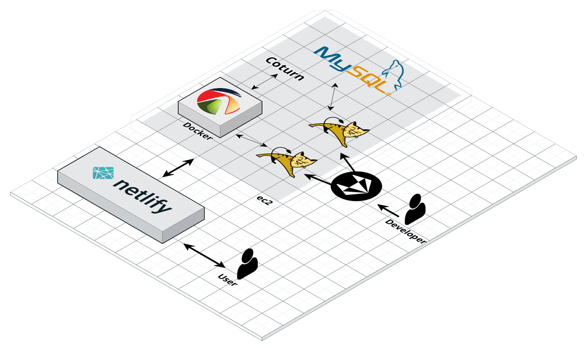

<!-- logo -->

## 👬 TOGETHER
### 🎉 프로젝트 소개
```TOGETHER```는 기존의 화상회의 프로그램에 **STT**(speach to text)와 **TTS**(text to speach) 기능을 추가하여   
듣고 말하고 보기 어려웠던 장애인 분들에게 편리함을 제공하는 서비스 입니다.  

### 💡 기술 스택
#### FrontEnd


#### BackEnd


### DevOps


### Co-tool


### 시스템 구상도


### 📌 주요 기능
* **회원 관리**
  
  - 회원 가입 시 장애 유무를 선택하여 사용자가 필요한 서비스를 제공받을 수 있습니다.
  
* **메인 화면**
  - 사용자의 고유 방을 확인할 수 있습니다.
  - 초대 코드를 입력하여 방에 입장할 수 있습니다.
  
* **컨퍼런스 기능**
  - `컨퍼런스`에 입장하기 전 닉네임을 설정해 입장할 수 있습니다.
  
  - `시각장애`를 가지고 계신 분은 **TTS** 기능을 제공받을 수 있으며
  
  - `청각장애`를 가지고 계신 분은 **STT** 기능을 제공받을 수 있습니다.
  
    

<details><summary><strong>역할</strong></summary>


  * 채팅방 구현

  * 화상회의 구현

  * STT, TTS 화상회의 연결

  * HTML 태그 이용 웹 접근성 확보

  </details>
